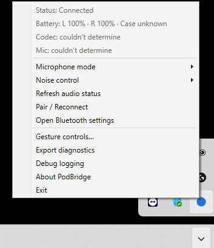

# PodBridge

**PodBridge** is an open-source companion **for AirPods on Windows** — battery,
automatic play/pause, honest audio-quality guidance, and a smart
microphone-profile policy, **driver-free and with no administrator rights**.
Advanced features (noise-control switching, gesture remap) are an optional,
clearly-labelled add-on.

> PodBridge is **not affiliated** with, authorized, sponsored, or endorsed by
> Apple Inc. "AirPods" and "Apple" are trademarks of Apple Inc., used here only
> descriptively to identify the hardware this software works with. PodBridge uses
> no Apple logo.

  
   
  <em>PodBridge lives in the system tray — battery, audio status, microphone &amp; noise-control modes, pairing, and diagnostics, one right-click away.</em>

## Quickstart

**Requires Windows 11 21H2+** (build 22621+). PodBridge is a **self-contained,
single-file `.exe`** — no installer, no admin rights, nothing else to set up.

1. Download **`PodBridge-<version>-win-x64.exe`** (or `-win-arm64` on
   Windows-on-ARM) from the latest
   [GitHub Release](https://github.com/bhemsen/PodBridge/releases/latest).
2. (Recommended) [verify the download](docs/user/README.md#verify-your-download)
   against `checksums.sha256` and the build-provenance attestation.
3. Double-click the exe and run it. On first run Windows SmartScreen will likely
   show **"Windows protected your PC / Unknown publisher"** — this is expected
   for a new, unsigned download (see [why](docs/user/README.md#verify-your-download)),
   not a sign of a problem. Click **More info → Run anyway**.

**Set up in under 2 minutes:** launch PodBridge (a tray icon appears — no window,
no UAC prompt) → right-click the icon and choose **`Pair / Reconnect`** to add
your AirPods in Windows Bluetooth settings → once they connect, the tray
**`Status:`** line reads **`Connected`** and the **`Battery:`** line shows
left/right/case charge. That's it: **paired, playing, battery visible.**

Settings and logs live under `%LOCALAPPDATA%\PodBridge`. To uninstall: quit
PodBridge (tray → `Exit`) and delete the exe and the `%LOCALAPPDATA%\PodBridge`
folder — there is nothing else on disk.

Full instructions — download, verify, setup, mic modes, auto-start, uninstall —
are in the **[user guide](docs/user/README.md)**.

## How PodBridge compares

| | **PodBridge** | MagicPods | AirPodsDesktop | Battery-only tools |
|---|:---:|:---:|:---:|:---:|
| Open-source | ✅ Apache-2.0 | ❌ closed | ✅ GPL-3.0 | ✅ mixed |
| Free | ✅ | ❌ paid | ✅ | ✅ |
| No driver / no admin by default | ✅ | ❌ kernel driver | ✅ | ✅ |
| Battery (buds + case) | ✅ | ✅ | ✅ | ✅ |
| Auto play/pause (in-ear) | ✅ | ✅ | ✅ | ❌ |
| Honest AAC / codec guidance | ✅ | — | ❌ | ❌ |
| Microphone-profile policy | ✅ | — | ❌ | ❌ |
| Noise-control switching (ANC / Transparency) | ✅ opt-in¹ | ✅ | ❌ | ❌ |
| Gesture remap | ✅ opt-in¹ | ✅ | ❌ | ❌ |

¹ Advanced-tier features use the optional, clearly-warned add-on driver.
"—" = not a documented focus of that tool. This reflects publicly-documented
features (see [`docs/prior-art.md`](docs/prior-art.md)) and may change.

**In short:** MagicPods matches the feature set but is paid, closed-source and
driver-based; the open alternatives are driver-free but battery-and-play/pause
only. **PodBridge is the only open, free, driver-free-by-default option that also
adds codec/microphone honesty — with noise-control and gestures as an explicit
opt-in.**

## Scope & honesty

PodBridge brings the AirPods experience as close to native as Windows technically
allows. It is honest about the limits and **never pretends to reproduce Apple's
own sound**: on supported hardware Windows plays media over **AAC**, the best
codec available on Windows, and drops to **SBC** on hardware that lacks it.
PodBridge also cannot provide simultaneous hi-fi stereo output **and** AirPods
microphone input — using the AirPods mic forces the Bluetooth **HFP** call profile
(mono call quality). That **A2DP↔HFP** trade-off is a Bluetooth-Classic platform
limit, not a bug; PodBridge manages it (see
[the user guide](docs/user/README.md#the-microphone-trade-off-a2dphfp) and
[`docs/vision.md`](docs/vision.md)), it does not solve it.

## Building

Requires the .NET 10 SDK.

    dotnet restore PodBridge.slnx
    powershell -NoProfile -File build/verify.ps1

## Documentation

- **[User guide](docs/user/README.md)** — download, verify, setup, mic modes, auto-start, uninstall.
- [`docs/`](docs/) — vision, architecture, roadmap, and per-phase notes.

## Special Thanks

- **[Claude](https://claude.ai)** (Anthropic) — PodBridge was designed, built,
  reviewed, and released with Claude as the AI pair-programmer.
- **[loopkit](https://github.com/skrischer/loopkit)** (by
  [@skrischer](https://github.com/skrischer)) — the spec → milestone → issues → PR
  workflow that drove every phase of this project.

## License

Apache-2.0. See [`LICENSE`](LICENSE), [`NOTICE`](NOTICE), and
[`THIRD-PARTY-NOTICES.md`](THIRD-PARTY-NOTICES.md).

## Disclaimer

Not affiliated with, authorized, or endorsed by Apple Inc. "AirPods" and "Apple"
are trademarks of Apple Inc., used here only descriptively. PodBridge uses no
Apple logo.

PodBridge is provided **"as is", without warranty of any kind**, express or
implied (see the Apache-2.0 License, Section 7, "Disclaimer of Warranty"). **You
use it entirely at your own risk and responsibility.** To the maximum extent
permitted by applicable law, the authors and contributors accept no liability for
any damage, data loss, or Bluetooth/audio-device misbehaviour arising from its
installation or use.
