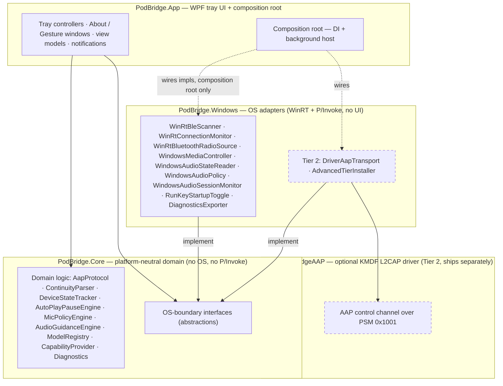
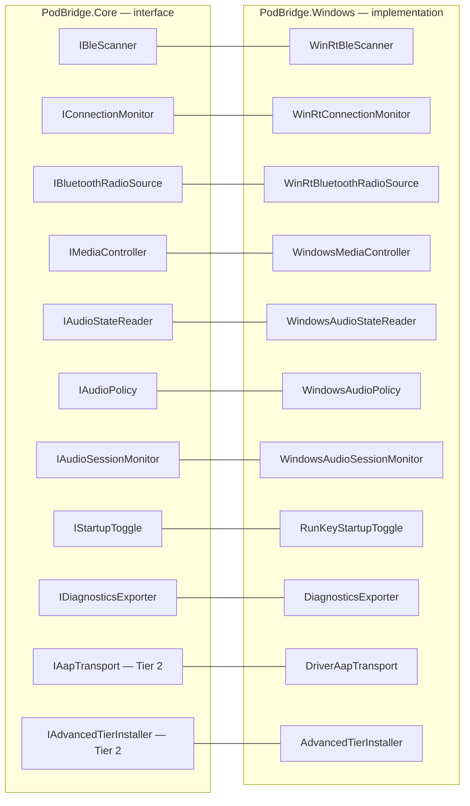
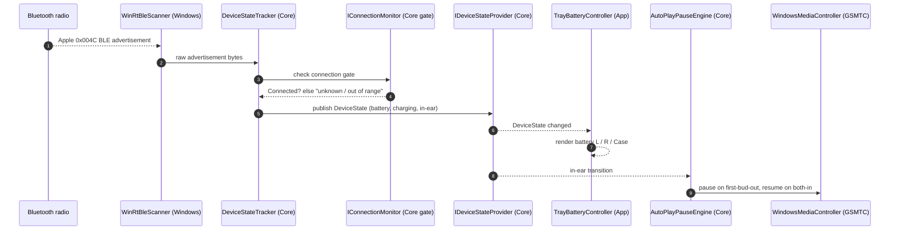
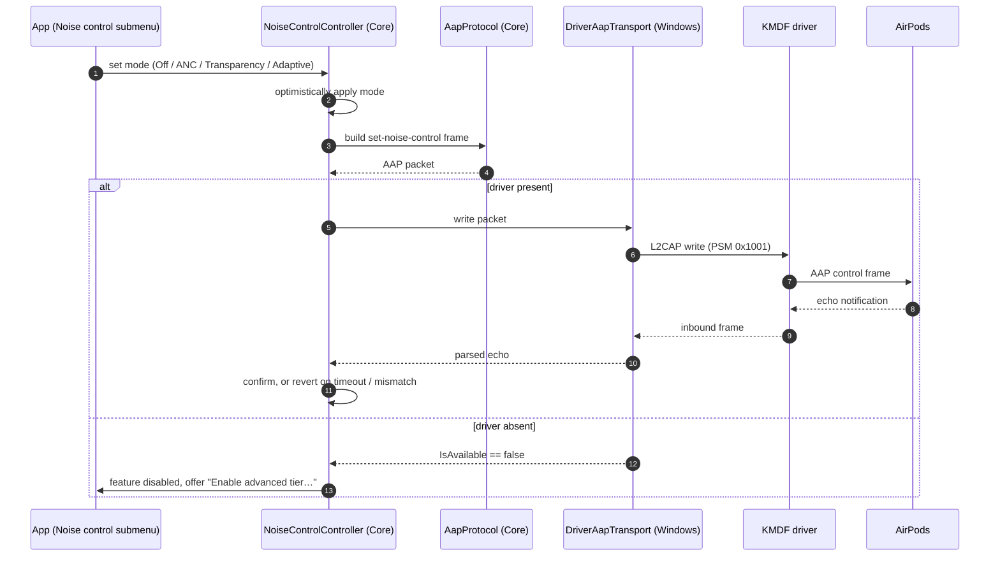
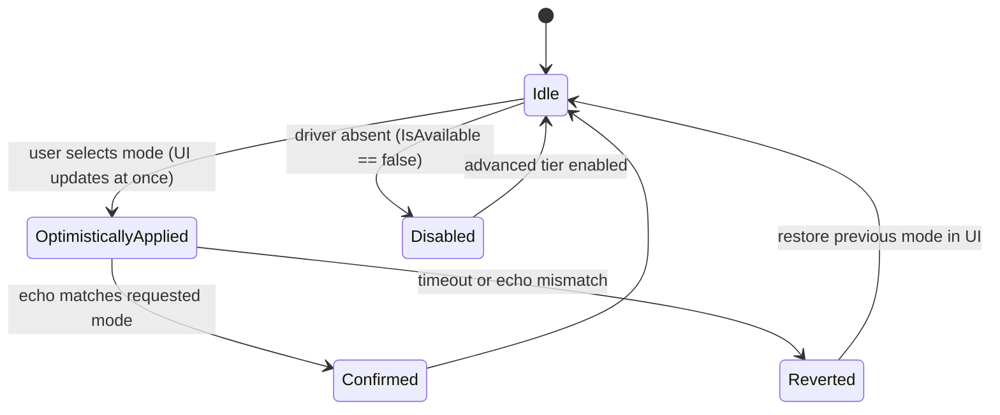

# Architecture diagrams

> Visual companion to [`architecture.md`](architecture.md). The prose in
> `architecture.md` is the source of truth; these diagrams mirror it at a glance
> and should be updated alongside it whenever components, boundaries, or flows
> change. Rendered natively by GitHub (Mermaid).

## 1. Component & layer map

Dependency direction and the Tier‑1 / Tier‑2 boundary. `PodBridge.Core` is
OS‑free; `PodBridge.Windows` implements Core's interfaces; `PodBridge.App` wires
the Windows implementations at the composition root only; the optional driver is
reached **only** through `DriverAapTransport`.



## 2. OS-boundary interface map

Every OS capability sits behind a `PodBridge.Core` interface, implemented by a
`PodBridge.Windows` adapter. Tier‑2 interfaces are only wired when the optional
driver path is used.



## 3. Key flows

### 3.1 Battery + auto play/pause (Tier 1, driver-free)



### 3.2 Mic-profile policy (Tier 1)

```mermaid
sequenceDiagram
    autonumber
    participant Sess as WindowsAudioSessionMonitor (Windows)
    participant Eng as MicPolicyEngine (Core)
    participant Pol as WindowsAudioPolicy (IPolicyConfig)

    Sess->>Eng: Communications capture session opened
    Eng->>Eng: decide per mode (HiFi-lock / Auto-switch / Call-mode)
    Eng->>Pol: set default vs communications endpoint per role
    Note over Eng,Pol: snapshot prior routing before first apply; auto-rollback on mid-apply failure
    Sess->>Eng: session released
    Eng->>Pol: restore prior routing
```

### 3.3 Noise-control switching (Tier 2, opt-in driver)



## 4. Noise-control state machine

The optimistic-set / echo-confirm / timeout-revert logic of
`NoiseControlController` over `IAapTransport`.


